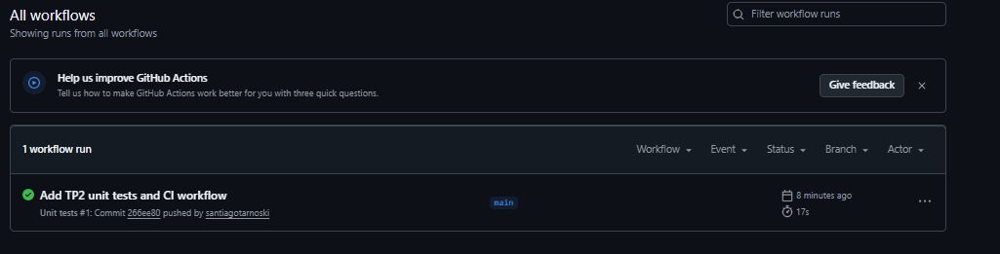

# TP2 - Pruebas unitarias e integracion

**Proyecto:** BookDesk - Sistema de reservas para coworking  
**Eje:** Pruebas de Software  
**Stack elegido:** React + Vite + Vitest  

---

## B0. Investigacion previa

### Clase de equivalencia

Una **clase de equivalencia** es un conjunto de datos de entrada que, para una funcion, deberian comportarse de la misma manera. En lugar de probar todos los valores posibles, se elige un representante de cada grupo.

Se aplica separando entradas validas e invalidas. Por ejemplo, para una funcion que valida horarios de reserva, todos los rangos donde la hora final es posterior a la inicial pertenecen a una clase valida. En cambio, rangos donde la hora final es igual o anterior pertenecen a clases invalidas.

**Ejemplo aplicado al proyecto:**  
Funcion real: `isValidReservationRange(startTime, endTime)`.  
Clase valida: `09:00` a `10:00`, porque el fin es posterior al inicio.  
Clase invalida: `10:00` a `09:00`, porque el fin es anterior al inicio.

### Valor limite

Un **valor limite** es un dato ubicado justo en el borde entre una clase valida y una invalida. Esta tecnica se usa porque muchos defectos aparecen en comparaciones como `<`, `<=`, `>`, `>=`.

Se aplica probando valores inmediatamente antes, en el limite y despues del limite. En un sistema de reservas, el final exacto de una reserva es un borde importante: si una sala esta reservada de `09:00` a `11:00`, el horario `10:00` esta ocupado, pero `11:00` ya deberia estar disponible.

**Ejemplo aplicado al proyecto:**  
Funcion real: `isSlotOccupied(reservations, resourceId, date, startTime)`.  
Reserva: `09:00` a `11:00`.  
Valor limite ocupado: `09:00`, inicio exacto de la reserva.  
Valor limite disponible: `11:00`, fin exacto de la reserva.

---

## B1. Pruebas unitarias con TDD

Las pruebas se ubicaron en `tests/unit/reservationRules.test.cjs`. Se eligieron funciones puras de reglas de reserva porque son criticas para evitar conflictos de disponibilidad en el coworking.

| Caso | Funcion bajo prueba | Tecnica | Datos de entrada | Resultado esperado |
|---|---|---|---|---|
| 1 | `isSlotOccupied` | Particion de equivalencia valida | Reserva confirmada `09:00-11:00`, consulta `10:00` | `true`, el horario esta ocupado |
| 2 | `isSlotOccupied` | Valor limite | Reserva confirmada `09:00-11:00`, consulta `11:00` | `false`, el fin exacto queda disponible |
| 3 | `isSlotOccupied` | Particion de equivalencia invalida | Reserva cancelada `12:00-13:00`, consulta `12:00` | `false`, las canceladas no ocupan |
| 4 | `getSlotReservation` | Valor limite | Reserva confirmada `09:00-11:00`, consulta `09:00` | Devuelve la reserva, el inicio exacto esta ocupado |
| 5 | `isValidReservationRange` | Particion de equivalencia valida | Inicio `09:00`, fin `10:00` | `true`, rango valido |
| 6 | `isValidReservationRange` | Valor limite | Inicio `09:00`, fin `09:00` | `false`, no puede durar cero minutos |
| 7 | `parseTimeToMinutes` | Valor limite invalido | Hora `24:00` | `null`, hora fuera del dia |

Comando para ejecutar:

```bash
cd frontend
npm test
```

---

## B2. Framework y automatizacion CI/CD

### Framework elegido: Vitest

Se eligio **Vitest** porque el frontend ya usa **Vite**, por lo que la integracion es directa y liviana. Es gratuito, rapido, compatible con modulos ES y permite escribir pruebas con una sintaxis similar a Jest (`describe`, `it`, `expect`).

Ventajas para BookDesk:

- No requiere migrar el stack actual.
- Ejecuta pruebas unitarias de funciones JavaScript puras rapidamente.
- Funciona bien en GitHub Actions con Node.js.
- Es apropiado para validar reglas de negocio del frontend como horarios, disponibilidad y estados.

### Pipeline CI/CD

Se agrego el workflow `.github/workflows/test.yml`. El pipeline se ejecuta automaticamente en:

- Cada `push`.
- Cada `pull request`.

Pasos del workflow:

1. Descargar el repositorio.
2. Configurar Node.js 20.
3. Instalar dependencias con `npm ci`.
4. Ejecutar `npm test`.

### Evidencias

**Captura obligatoria del workflow en GitHub Actions:**  
El workflow `Unit tests` se ejecuto correctamente en GitHub Actions luego del push del commit `266ee80`.



**Video breve de evidencia audiovisual:**  
Video grabado y subido a YouTube como no listado.

Enlace:

```text
https://youtu.be/HRHM5oJGmgQ?si=RKAZXx9qMte6IiSg
```

---

## B3. Diseno conceptual de pruebas de integracion

### Dependencias externas identificadas

1. **Supabase Database**
   - Guarda recursos (`resources`), reservas (`reservations`) y perfiles (`profiles`).
   - En una prueba de integracion futura se podria reemplazar por un stub del cliente Supabase que devuelva datos controlados.

2. **Supabase Auth**
   - Gestiona registro, login y sesion de usuarios.
   - En una prueba de integracion futura se podria mockear `signInWithPassword`, `signUp` y `signOut` para simular usuarios miembro/admin sin depender del servicio real.

### Como mockear o stubear

Para el cliente de Supabase se podria crear un doble de prueba que implemente solo los metodos usados por BookDesk:

- `supabase.auth.signInWithPassword`
- `supabase.auth.signUp`
- `supabase.from('reservations').select/insert/update`
- `supabase.from('resources').select/insert/update/delete`

Esto permitiria probar el flujo completo de reserva sin tocar una base de datos real.

### Ejemplo de flujo de prueba de integracion futura

```text
Dado un usuario miembro autenticado
Y una sala existente en Supabase stub
Y una reserva confirmada de 09:00 a 11:00
Cuando el usuario intenta reservar esa misma sala a las 10:00
Entonces el sistema debe marcar el horario como ocupado
Y no debe llamar a insert sobre la tabla reservations
```

Otro flujo posible:

```text
Dado un administrador autenticado
Cuando crea un nuevo recurso "Sala Workshop"
Entonces el sistema llama a supabase.from('resources').insert(...)
Y luego el recurso aparece en el listado de recursos
```

### Herramienta recomendada para dobles de prueba

Se recomienda **Vitest mocks** (`vi.fn`, `vi.mock`) porque ya forma parte del framework elegido. Permite simular modulos, funciones asincronicas y respuestas del cliente Supabase sin agregar otra dependencia.

Para pruebas mas cercanas a navegador tambien podria utilizarse **MSW (Mock Service Worker)** en una etapa posterior, ya que intercepta requests HTTP y permite simular APIs externas de forma realista.
